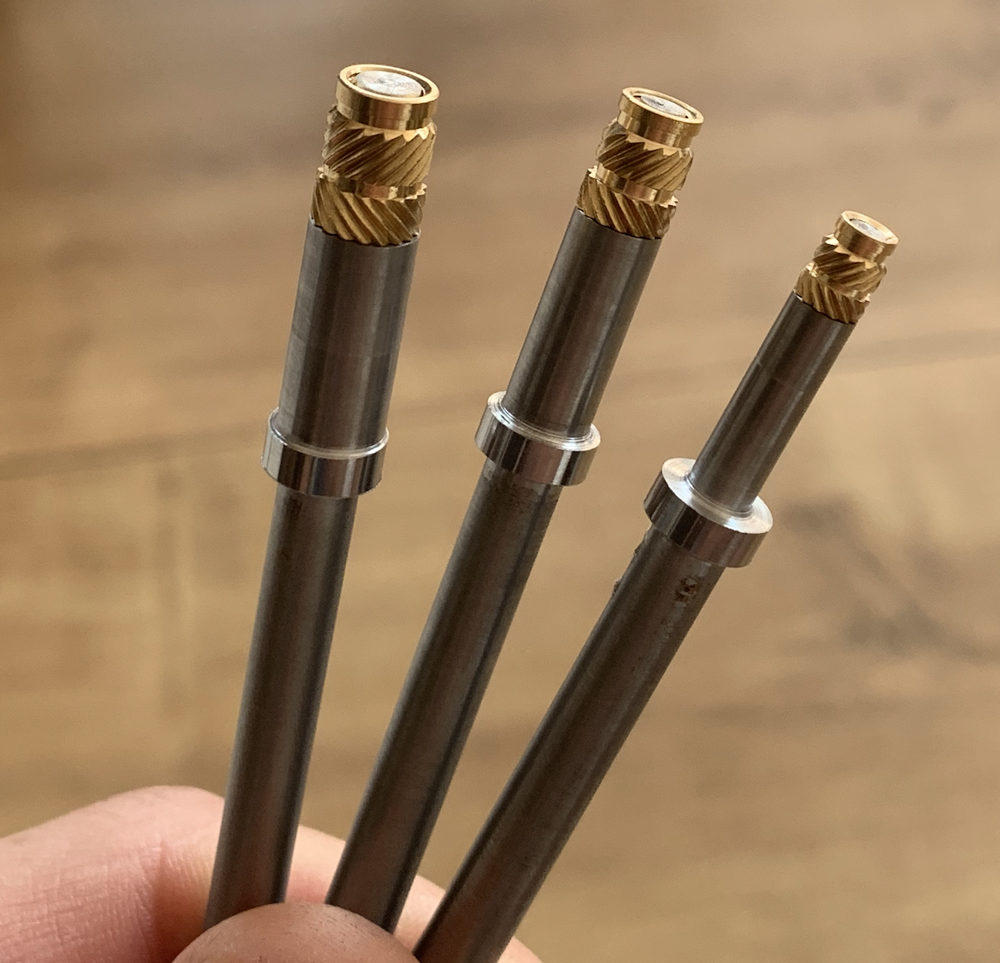

# Heat_Insert_Press

(Click on the image for a small video.)

I recently build this simple construction to press threaded inserts into 3D printed parts with the help of an old soldering iron. I have replaced the original soldering iron tip with some self made insert tips out of stainless steel which are made on a lathe (unfortunately not by myself). Nevertheless it works with the original soldering tip as well.

</a>

Don't forget the fan, because the soldering iron is not made to be used in vertical direction and the heat may destroy the plastic above the soldering iron tip.

</a>

For the complete build you have to print the following:
- 2x slider_mount.stl
- 2x rail_mount.stl
- 2x adjustment_screw.stl
- 1x solderingiron_mount.stl
- 1x fan_mount.stl
- 1x cable_box.stl (optional)
- 100x testboard.stl (:D)

It is a simple straight forward construction. For those of you who gonna build it, I have uploaded a few pictures of the main components. If you still have questions then feel free to ask!

Have fun! :)
